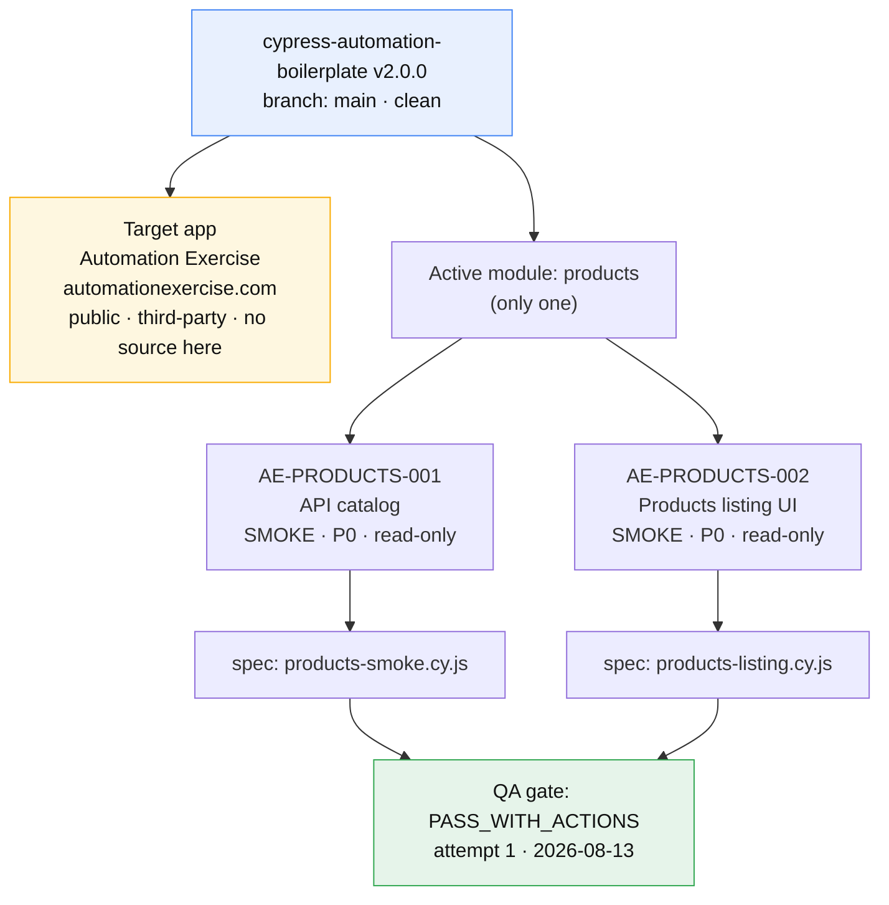
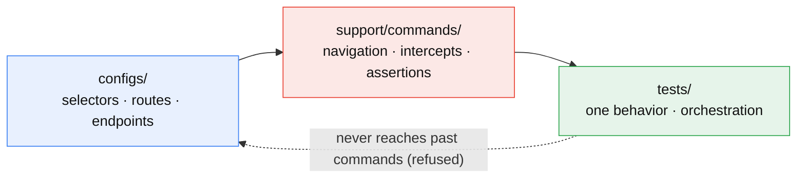
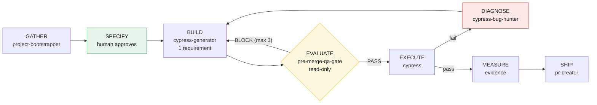
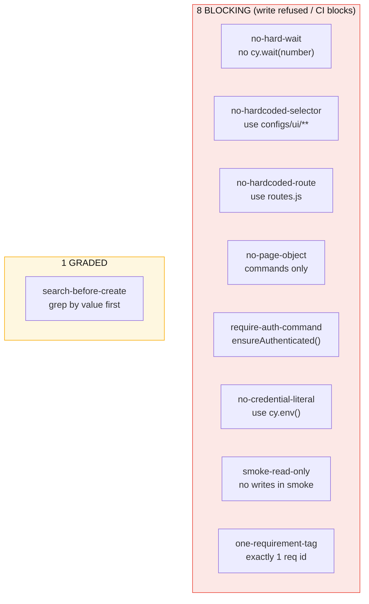
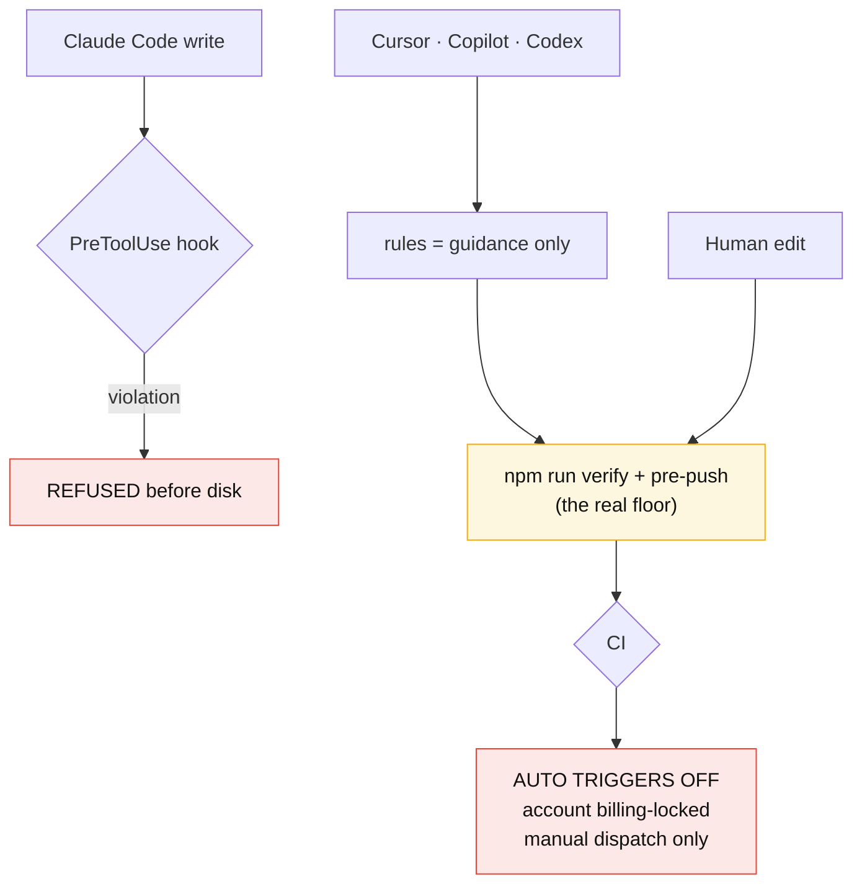
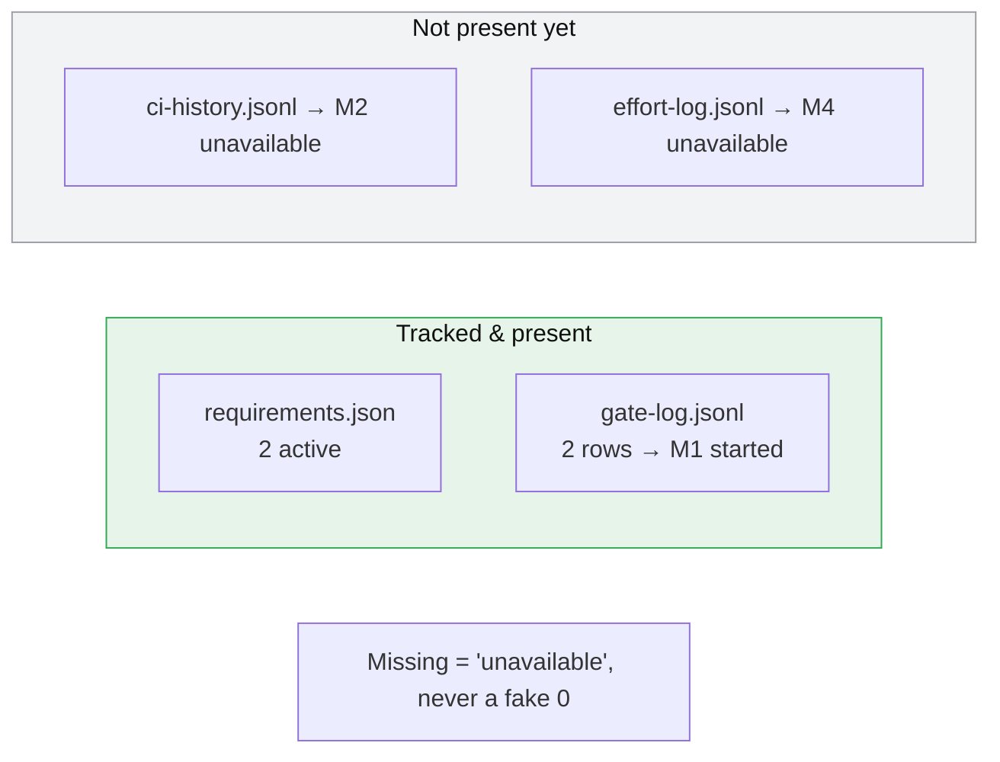
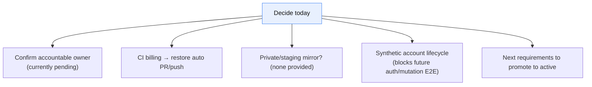
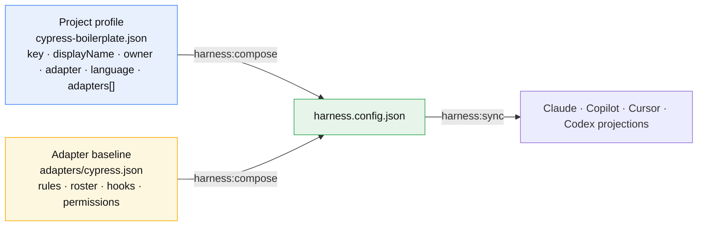
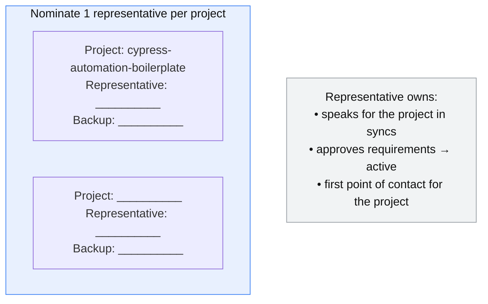
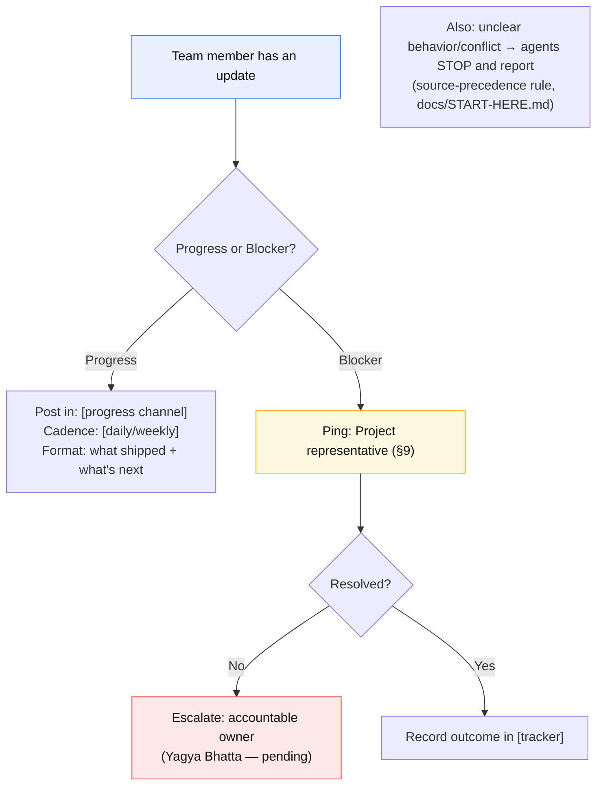

# First Team Session — `cypress-automation-boilerplate`

Kickoff visual brief. Date: 2026-08-14 · Repo: `github.com/lfyagya/cypress-automation-boilerplate` · Branch: `main`.

Every diagram below traces to a file in this repo:
state to `evidence/requirements.json`, `evidence/gate-log.jsonl`, and `docs/application-intelligence/**`;
rules/roster to `harness.config.json`; enforcement/CI to `.github/workflows/*.yml` and `docs/START-HERE.md`.

---

## 1. What we have today (state snapshot)

---

## 2. Architecture — one direction only

---

## 3. How work flows + who does each step

---

## 4. The 9 rules at a glance

---

## 5. Enforcement reality (important caveat)

---

## 6. Evidence / metrics — what is fed vs empty

---

## 7. Open decisions for the team

---

## 8. Project profile (what defines this project)

Facts below are from `harness/profiles/projects/cypress-boilerplate.json`. This ~8-line profile is the
only project-specific input; all rules/roster/policy come from `harness/profiles/adapters/cypress.json`.
The profile composes → `harness.config.json` → projections for each enabled tool.

| Field | Value |
| --- | --- |
| key | `cypress-boilerplate` |
| displayName | Cypress Automation Boilerplate |
| profile owner | `cypress-harness-maintainers` (harness maintainers — **not** the app owner) |
| adapter / language | `cypress` / `javascript` |
| projectName / repo | `cypress-automation-boilerplate` |
| enabled AI tools | Claude · Copilot · Cursor · Codex (all `true`) |

> Two different "owners": profile owner above = harness maintainers; the **application accountable
> owner** is Yagya Bhatta — pending formal confirmation (`docs/application-intelligence/project-context.md`).

---

## 9. One representative per project (nominate today)

The repo carries no roster of people — fill these in live during the session. No names are assumed.

---

## 10. How / who to reach — progress & blockers

Channels and owners are not in the repo — agree and record them in the session (placeholders shown).

Fields to fill in during the session:

| What | Value (to agree) |
| --- | --- |
| Progress channel + cadence | __________ |
| Blocker / escalation channel | __________ |
| Issue tracker / board | __________ |
| Project representative(s) | __________ (see §9) |
| Accountable owner (confirm) | Yagya Bhatta — pending |

---

## Suggested agenda

1. Repo purpose + Config → Commands → Tests (§2) — 10 min
2. Current state: products module, 2 requirements, 2 passing specs (§1) — 10 min
3. Project profile — what defines this project (§8) — 5 min
4. The 9 rules and why (§4) — 10 min
5. Enforcement reality: Claude-only write blocking; CI manual-only now (§5) — 5 min
6. Local setup + `npm run verify` live — 10 min
7. Nominate one representative per project (§9) — 5 min
8. Agree how/who to reach for progress & blockers (§10) — 10 min
9. Open decisions and owners (§7) — 10 min
